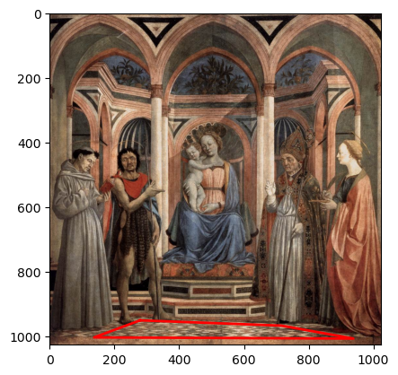
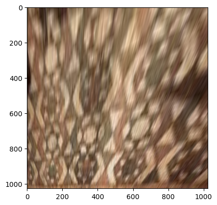

This notebook helps us in visualizing various surfaces in an art drawing (or any picture, honestly) in an elevation view without any perspective distortion; which means it allows you to see the floor in a painting/picture from the top view or the right side of a wall in a painting as if you are standing in front of the wall. It uses homography to project the selected points to a rectangle (same size as the image).

Please run it on local jupyter notebook since it needs interactive environment for you to be able to select points.

Results:

