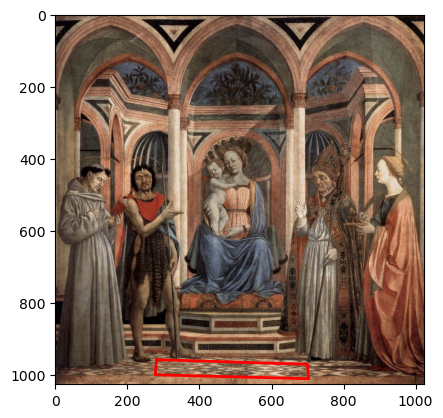
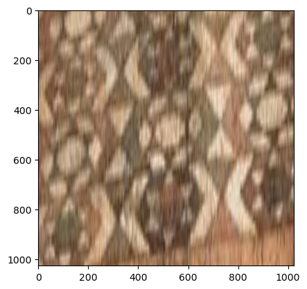
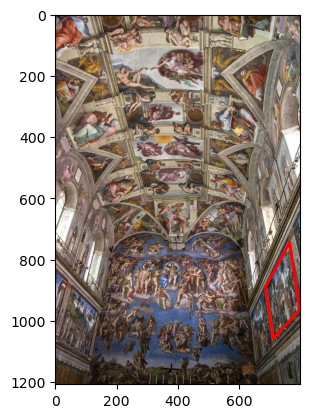
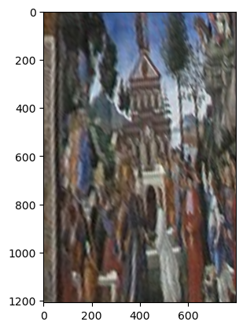

# Homography Projection for Art

Homography Projection for Art is a web application that allows users to select points on an image, compute homography transformations, and visualize the transformed image, i.e. it allows you to see the floor in a painting/picture from the top view or the right side of a wall in a painting as if you are standing in front of the wall. The project is built using a React frontend and a FastAPI backend.  

---

---

---

